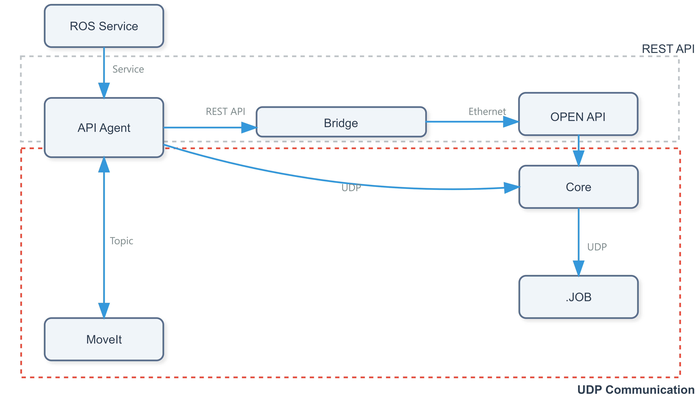

# 1. ROS2 Control Gazebo Simulation

이 프로젝트는 HD Hyundai Robotics 로봇을 위한 ROS2 Gazebo Simulation 및 ROS2 Driver 환경을 제공합니다.

**[https://github.com/hyundai-robotics/hdr_simulation_gz](https://github.com/hyundai-robotics/hdr_simulation_gz)**

**[https://github.com/hyundai-robotics/hdr_ros2_driver](https://github.com/hyundai-robotics/hdr_ros2_driver)**

# 특징

- 로봇 상태 조회 및 제어
- I/O 및 PLC 제어
- 파일 및 로그 관리
- 작업 및 프로그램 제어
- 시스템 시간 관리

    

#### 위 사진에서 알 수 있듯이 현재 ROS2 Service를 사용하여 구현된 부분은 Open API로 연결되고, 로봇의 이동과 관련된 부분은 UDP 통신으로 연결됩니다.
