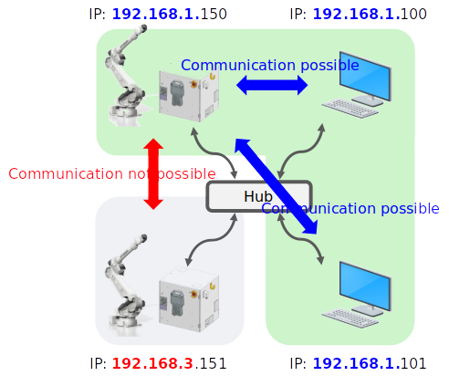
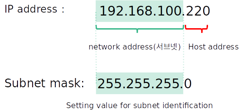
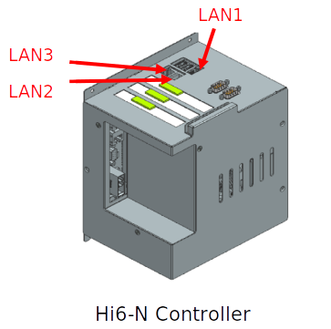
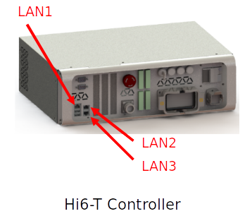
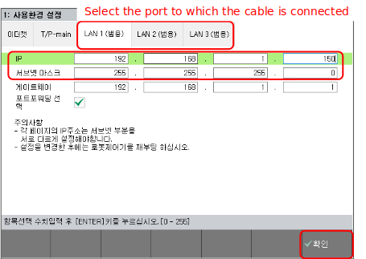
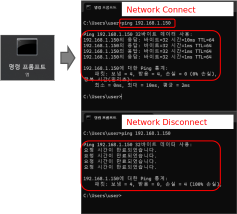

# Ethernet Communication Manual

This manual explains how to interface with external equipment using Ethernet UDP/IP and TCP/IP communication, utilizing the enet module provided as a standard feature on the Hi6 controller.

Please refer to the diagram below for the basic connection structure of Ethernet communication.

LAN communication: Communication is possible within the same network or with a different host/PC.

  

  

## 2-1 Cable Connection

Connect the Ethernet cable for communication with other equipment to the user Ethernet port.

- Choose one from LAN1, LAN2, or LAN3
- Hi6-N controller: Top of the main module on the door middle panel
- Hi6-T controller: Front Ethernet port of the controller

  

    
  

  

    
  

## 2-2 Controller Network Settings

Set the IP address of the Hi6 controller using the teaching pendant.

1. [F2:System] → [2:Control Parameters] → [9:Network] → 
2. [1:Environment Settings] → Click [LAN# (General)] where the cable is connected
3. Enter IP address and subnet mask
   * Note: Assign values and select gateway and port forwarding if necessary
4. After setting, press [F7:Confirm] → Reboot the controller

  

Verify if Ethernet communication is possible with the other device.

If the other device is a PC, check the network connection status between the two devices through a Ping test in the [Command Prompt].

  

