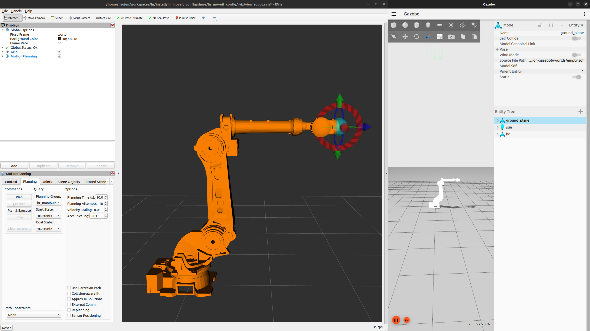
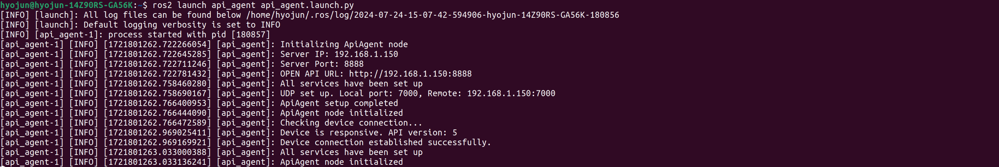
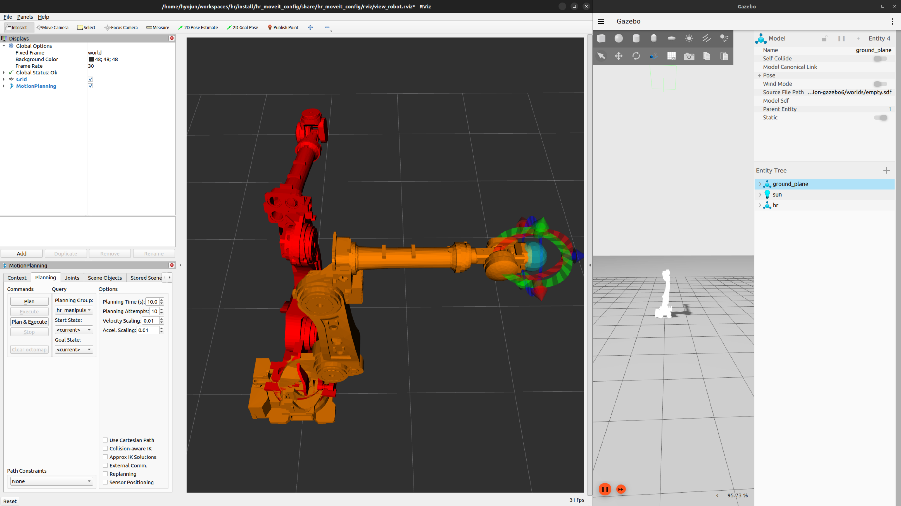

# Usage Guide for HD Hyundai Robotics Simulation

## Supported Robots

The following robots can be simulated using the `hr_sim_moveit.launch.py` file in the `hr_simulation` package:

```text
"ha006b", "hh7", "hh020", "hs220_02", "hx400", "yl012"
```

> **NOTE:** You can change the simulated robot by modifying the `hr_type` parameter in `hr_sim_moveit_launch.py`. Currently, only `hs220_02` is enabled for simulation.

## Simulation and Control

### Step 1: Launch Simulation and MoveIt

To start the simulation and MoveIt, run the following command:

```bash
ros2 launch hr_simulation hr_sim_moveit.launch.py
```

This will open a window similar to the image below:



### Step 2: Launch API Agent

To communicate with the Hi6 controller, run:

```bash
ros2 launch api_agent api_agent.launch.py
```

You should see output similar to this:



### Step 3: Prepare the Robot Controller

After launching the HD Hyundai Robotics robot simulation, follow these steps to control the robot:

1. Switch the controller's TP to playback mode.
2. Copy the `.job` code provided in the package to the appropriate location.
3. Load the copied `.job` file on the TP.

### Step 4: Control the Robot

Execute the following steps:

1. Turn the motor ON:

   ```bash
   ros2 service call /api_agent/robot/post/motor_control std_srvs/srv/SetBool "{data: true}"
   ```

2. Start the program:

   ```bash
   ros2 service call /api_agent/robot/post/robot_control std_srvs/srv/SetBool "{data: true}"
   ```

3. Set initialization pose:
   This service adjusts the Gazebo position based on the actual robot's pose values:

   ```bash
   ros2 service call /api_agent/inital_pose std_srvs/srv/Trigger
   ```

   After executing this command, you should see the red robot model move to match the current position of the actual robot, as shown in the image below:

   

### Step 5: Plan and Execute Movements

Once the initialization is complete, you can use the Planning tab to plan and execute movements. The robot will follow these planned movements.

## Additional Notes

- Ensure that all necessary packages are installed and built in your workspace before running these commands.
- Always verify that the simulated environment matches your physical setup before executing any movements.
- Refer to the specific robot's documentation for any model-specific instructions or limitations.
- The red robot model in the simulation represents the current position of the actual robot, while the other model is used for planning and visualization of planned movements.
- Be cautious when executing planned movements, especially in a real-world environment, to avoid collisions or unexpected behavior.
