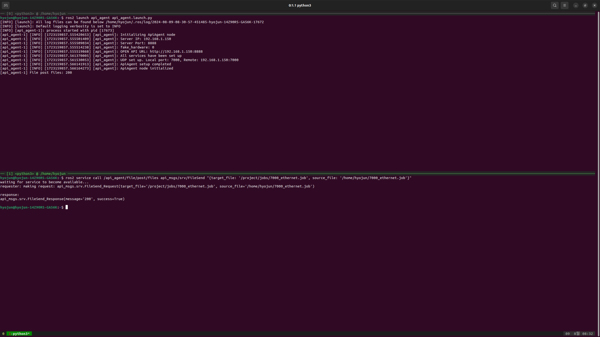

# HD 현대 로보틱스 시뮬레이션 사용 가이드

## 지원 로봇

`hdr_simulation` 패키지의 `hdr_sim_moveit.launch.py`파일을 사용하여 아래 로봇을 시뮬레이션할 수 있습니다.

```text
"ha006b", "hh7", "hh020", "hs220_02", "hx400"
```
> **참고ㅣ** hdr_sim_moveit.launch.py의 `hdr_type` 파라미터를 수정하여 시뮬레이션할 로봇을 변경할 수 있습니다. 현재 `hs220_02`만 시뮬레이션이 활성화되어 있습니다.

## 시뮬레이션 및 제어

### Step 1: 시뮬레이션 및 Moveit 실행

`hdr_simulation` 디렉토리에서 아래 명령어를 실행하여 시뮬레이션과 Moveit을 시작합니다.

```bash
ros2 launch hdr_simulation hdr_sim_moveit.launch.py
```

이 명령어를 실행하면 아래와 유사한 창이 열립니다.


### Step 2: hdr ros2 driver 실행

`ip주소`, `port`, 등을 설정하려면 아래 경로에서 설정 파일을 수정하십시오.

Hi6 컨트롤러와 통신하려면 아래 명령어를 실행합니다.

```bash
ros2 launch hdr_ros2_launch ros2_driver.launch.py
```

실행 후 아래와 같은 출력이 표시됩니다.


### Step 3: 로봇 컨트롤러 준비

HD 현대 로보틱스 로봇 시뮬레이션을 실행한 후, 로봇을 제어하려면 아래 단계를 따르세요:

1. 컨트롤러 TP(Touch Panel)을 `Playback`로 전환합니다.
2. 패키지에 제공된 `.job`코드를 적절한 위치로 복사합니다.
3. 복사한 `.job`파일에 TP에 로드합니다.

### Service를 이용한 `.job`코드 TP삽입 방법

네트워크를 통해 컨트롤러에 연결한 후 아래 명령어를 실행삽니다.

```bash
ros2 launch hdr_ros2_launch ros2_driver.launch.py
```

그런 다음 `.job`코드가 있는 위치를 확인하고 아래 명령어를 실행하십시오:


```bash
ros2 service call /hdr_ros2_driver/file/post/files hdr_msgs/srv/FileSend "{target_file: '/project/jobs/7000_ethernet.job', source_file: '/home/<your_username>/hdr_ros2_driver_github/7000_ethernet.job'}"
```

```bash
ros2 service call /hdr_ros2_driver/file/post/files hdr_msgs/srv/FileSend "{target_file: '/project/jobs/7001.job', source_file: '/home/<your_username>/hdr_ros2_driver_github/7001.job'}"
```

- target_file: TP에 복사될 파일의 위치
- source_file: 컴퓨터에서 전송할 파일의 위치



### Step 4: 로봇 제어

아래 단계를 차계대로 실행하세요

1. 모터 ON:

   ```bash
    ros2 service call /hdr_ros2_driver/robot/post/motor_control std_srvs/srv/SetBool "{data: true}"
   ```

2. 프로그램 시작:

   ```bash
   ros2 service call /hdr_ros2_driver/robot/post/robot_control std_srvs/srv/SetBool "{data: true}"
   ```


### Step 5: 이동 경로 계획 및 실행

초기화가 완료되면 Moveit의 Planning 탭을 사용하여 이동 경로를 계획하고 실행할 수 있습니다. 로봇은 계획된 경로를 따라 이동합니다.

## 추가 참고 사항

- 명령어 실행 전에 필요한 모든 패키지가 설치 및 빌드되었는지 확인하세요.
- 시뮬레이션 환경이 실제 물리적 환경과 일치하는지 항상 확인한 후 이동 경로를 실행하세요.
- 각 로봇 모델의 고유한 지침 및 제한 사항은 해당 로봇의 문서를 참조하세요.
- 시뮬레이션에서 빨간 로봇 모델은 실제 로봇의 현재 위치를 나타내며, 다른 모델은 계획 및 시각화를 위해 사용됩니다.
- 실제 환경에서 경로를 실행할 때 충돌이나 예상치 못한 동작을 방지하기 위해 주의가 필요합니다.